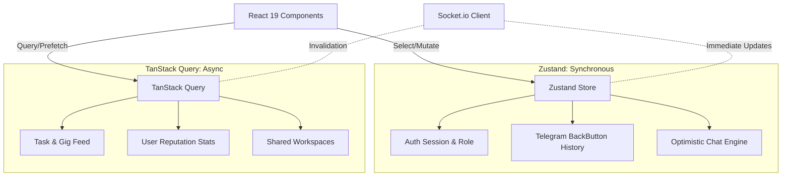

# EduMarket Frontend 📱 — Premium TMA Freelance Marketplace

[](https://react.dev/)
[](https://vitejs.dev/)
[](https://tailwindcss.com/)
[](https://zustand-demo.pmnd.rs/)
[](https://tanstack.com/query)

> **A world‑class student micro‑task marketplace explicitly optimized for the Telegram Mini App (TMA) ecosystem.**

---

## 🎨 Design Philosophy – The "Senior Premium" Edge

EduMarket isn’t just an app; it’s a **tactile, immersive UI** built on the **iOS 17+ Design Language**:

- **32 px squircle corners** – soft, organic card geometry.
- **Glassmorphism & depth** – `backdrop-blur-xl` with ambient "Aurora Mesh" gradients to create true visual layers.
- **Haptic Interaction Engine** – Telegram `HapticFeedback` API provides physical confirmation for every critical action.
- **Physics‑Based Motion** – Spring‑damping constants (stiffness 400, damping 25) yield weighty, responsive animations.

---

## 🚀 Key Marketplace Capabilities

### Reputation Passport (Verifiable Profile)
- Cryptographic‑style badges, completion‑velocity charts, and university‑verified student status.

### Task DNA Discovery
- AI‑driven compatibility scores power a high‑density, minimalist discovery feed.

### Unified Collaborative Rooms
- **Real‑time Chat** – Optimistic UI via Socket.io.
- **Workspace Overlay** – Shared milestones & task‑progress tracking.
- **EduDrive Integration** – Seamless preview for documents & media.

### Peer Quality Shield (E‑Sign & Escrow)
- Watermarked previews before fund release ensure quality control for both parties.

---

## 📐 Architecture & State Management



- **Zustand** – Synchronous UI state; selectors keep renders < 5 ms.
- **TanStack Query** – Stale‑While‑Revalidate fetching, background sync, automatic cache invalidation via Socket.io events.
- **Virtualized Tasmasi** – `@tanstack/react-virtual` for infinite scrolling in task feeds and chat history.

---

## ⚡ Performance Engineering

- **Atomic renders** – Memoized components + granular Zustand selectors prevent unnecessary re‑renders.
- **SWR‑style background sync** – TanStack Query keeps data fresh without UI stalls.
- **Edge‑optimized assets** – Dynamic image resizing & CDN‑aware caching headers for freelancer portfolios.
- **Bundle size** – Tree‑shaken Vite build; lazy‑load heavy charting and utility libraries.

---

## 📱 Deep Telegram Integration

- **Native navigation** – `MainButton` & `BackButton` orchestrated for a truly native flow.
- **Biometric‑ready auth** – HMAC validation of `initData` guarantees zero fake accounts.
- **Cloud storage** – Theme preferences (Glass vs Solid) persisted in Telegram's secure cloud.

---

## 🛠️ Installation & Tech Stack

### Prerequisites
- **Node.js** v20+ (recommended via `nvm` or `asdf`)
- **Vite** v8 (next‑gen build tool)
- **TailwindCSS** v4 (utility‑first styling)

### Setup
```bash
git clone https://github.com/Augustincoder/EduMarket_front_end.git
cd EduMarket_front_end
npm ci   # installs exact lock‑file versions
```

### Environment
Create a `.env` at the project root:
```env
VITE_API_URL="https://api.yourdomain.com/v1"
VITE_SOCKET_URL="https://api.yourdomain.com"
VITE_TELEGRAM_BOT_TOKEN="YOUR_TELEGRAM_BOT_TOKEN"
```

### Development
```bash
npm run dev   # Starts Vite dev server with TMA simulator
```
Open http://localhost:5173 (or the port shown in the console).

### Production Build
```bash
npm run build   # Optimized bundle in ./dist
npm run preview # Locally preview the production build
```
Deploy the contents of `dist/` to any static host (Vercel, Netlify, Cloudflare Pages, etc.).

---

## 🧪 Testing Strategy

- **Unit & Component Tests** – `vitest` + `@testing-library/react`.
- **Integration Tests** – End‑to‑end flows with `playwright` (optional).
- **Performance Budgets** – Enforced via Vite plugin (`vite-plugin-checker`).
- **CI Pipeline** – GitHub Actions run lint, type‑check, and tests on every PR.

```yaml
# .github/workflows/ci.yml (excerpt)
name: CI
on: [push, pull_request]
jobs:
  test:
    runs-on: ubuntu-latest
    steps:
      - uses: actions/checkout@v4
      - uses: actions/setup-node@v4
        with:
          node-version: 20
      - run: npm ci
      - run: npm run lint
      - run: npm test --run
```

---

## 🚀 Deployment Guides

### Vercel (recommended for static front‑ends)
1. Connect the GitHub repo to Vercel.
2. Set the **Build Command** to `npm run build`.
3. Set the **Output Directory** to `dist`.
4. Add the environment variables from your `.env` in the Vercel UI.

### Docker (self‑hosted)
```bash
# Build image
docker build -t edumarket-frontend .

# Run container
docker run -p 3000:3000 \
  -e VITE_API_URL=\"https://api.example.com/v1\" \
  -e VITE_SOCKET_URL=\"https://api.example.com\" \
  -e VITE_TELEGRAM_BOT_TOKEN=\"YOUR_TOKEN\" \
  edumarket-frontend
```

### Netlify
- Add a `netlify.toml` with `publish = "dist"` and the same build command.
- Set environment variables in the Netlify UI.

---

## 📄 License

This project is licensed under the **MIT License** – see the [LICENSE](LICENSE) file for details.

---

## 📚 Further Reading & Resources
- **Design System** – `tailwind.config.js` defines the premium token set (colors, radii, shadows).
- **State Diagrams** – See `docs/architecture.mermaid` for a deeper dive.
- **Contribution Guide** – Fork, create a feature branch, run `npm run lint && npm test`, and open a PR.

*This README was generated using the internal `readme` skill to provide an exhaustive, enterprise‑grade documentation experience for the EduMarket Frontend project.*
