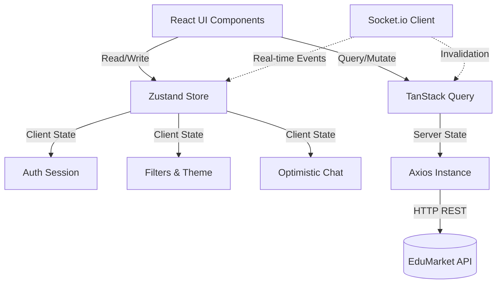

<div align="center">
  <br />
  <h1>EduMarket Frontend 📱</h1>
  <p><strong>The Enterprise-Grade Freelancer Marketplace for Telegram Mini Apps</strong></p>
  <p>
    
    
    
    
    
  </p>
</div>

<br />

## 📖 Table of Contents
- [Overview](#-overview)
- [Enterprise Features](#-enterprise-features)
- [System Architecture](#-system-architecture)
- [Directory Structure](#-directory-structure)
- [Environment Variables](#-environment-variables)
- [Development Setup](#-development-setup)
- [State Management Strategy](#-state-management-strategy)

---

## 🌟 Overview
EduMarket Frontend is a high-performance, mobile-first Web Application explicitly designed to run seamlessly inside **Telegram Mini Apps**. It adopts a sleek **iOS 17+ design language** leveraging glassmorphism, dynamic micro-interactions, and spring-based animations to deliver a truly native feel. 

The application connects freelancers with high-end clients through a secure, feature-rich environment built around trust, reputation, and verified milestones.

---

## 🚀 Enterprise Features
- **Reputation Passport**: A unified, cryptographic-like verifiable profile for freelancers containing success rates, milestone accuracy, and dispute ratios.
- **Task DNA Matching**: Smart task recommendations using AI NLP vectors (via backend) rendered in a highly engaging, Tinder-like feed.
- **Live Task Pulse**: A real-time, WebSocket-powered ticker tape showing active ecosystem transactions and demand spikes.
- **Stealth Mode**: Privacy-first exploration for high-profile clients; browse without altering online status or read receipts.
- **Peer Quality Shield**: Advanced reporting and admin-moderated dispute resolution flows directly embedded into the task lifecycle.
- **Learning Compass**: Goal-oriented skill tracking and visual milestone maps for freelancers.

---

## 📐 System Architecture

The frontend leverages a modular architecture separating UI components, server state, and global client state.



---

## 📁 Directory Structure

```text
src/
├── app/                  # Application initialization and routing logic
├── components/           # Shared, reusable UI components
│   ├── ui/               # Base primitives (Buttons, Inputs, BottomSheets)
│   ├── forms/            # Complex forms and validation
│   └── cards/            # Reusable cards (TaskCard, BidCard)
├── hooks/                # Custom React hooks (useTasks, useDebounce)
├── lib/                  # Utilities, constants, and API helpers
├── screens/              # Route-level Page components (Features)
│   ├── admin/            # CRM and moderation screens
│   ├── auth/             # Onboarding and login flow
│   ├── client/           # Client-specific views (Create Task)
│   ├── freelancer/       # Freelancer-specific views (Feed, Earnings)
│   └── shared/           # Shared views (Profile, Chat, Task Detail)
├── services/             # API wrappers (Axios integration)
└── store/                # Zustand global state slices
```

---

## 🔐 Environment Variables

Create a `.env` file in the root directory. The following variables are required:

| Variable | Description | Example |
|----------|-------------|---------|
| `VITE_API_URL` | Base URL for the Backend API | `http://localhost:5000/api/v1` |
| `VITE_SOCKET_URL` | Base URL for the WebSocket Server | `http://localhost:5000` |
| `VITE_SENTRY_DSN` | Sentry Error Tracking DSN | `https://example@sentry.io/123` |
| `VITE_ENV` | Current environment (`development`/`production`) | `development` |

---

## 🛠 Development Setup

1. **Install Dependencies**
   ```bash
   npm install
   ```

2. **Run the Development Server**
   ```bash
   npm run dev
   ```
   *Note: To test Telegram specific features locally, you may need to expose your localhost using `ngrok` or `localtunnel` and set it as your Telegram Bot's Web App URL.*

3. **Code Quality Checks**
   ```bash
   npm run lint
   ```

4. **Production Build**
   ```bash
   npm run build
   ```

---

## 🧠 State Management Strategy

To ensure high performance and avoid unnecessary re-renders, the application strictly separates state concerns:
- **Server State (TanStack Query)**: Handles all asynchronous data fetching, caching, and background synchronization (e.g., fetching task feeds, user profiles).
- **Client Global State (Zustand)**: Manages synchronous global state such as UI toggles, active filters, and the optimistic chat engine.
- **Component State (useState/useReducer)**: Used strictly for ephemeral, localized component logic (e.g., form inputs before submission, toggle animations).
